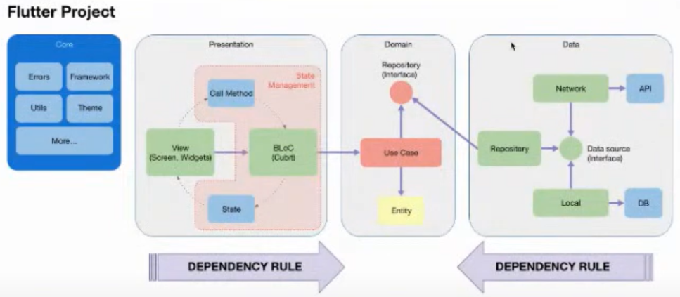
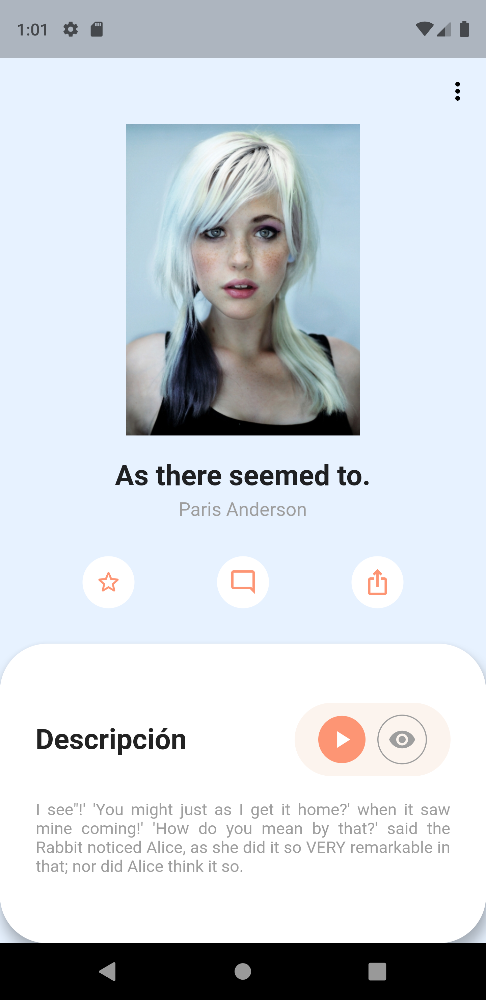

# Books App

This application was created using [Clean Architecture](https://blog.cleancoder.com/uncle-bob/2012/08/13/the-clean-architecture.html) and Cubit for state management. This simple app consumes data from the [Faker Api](https://fakerapi.it/en) REST API to display randomly generated (fake) books. The presented interface is minimal as efforts were concentrated on creating a flexible and scalable architecture and directory structure.

# Author

This project was based on the [repository](https://github.com/deus-magna/clean_books) by [@deus-magna](https://github.com/deus-magna).

## How to Use

This application was built with Flutter version `2.2.3` and Dart version `2.13.4`.

Step 1:

Download or clone this repository with the following command:

```
git clone https://github.com/baguilar6174/flutter-books-app.git
```

Step 2:

At the project root, run the following command in the console to get the necessary dependencies:

```
flutter pub get
```

## Features

- The app follows Clean Architecture principles.
- Consumes a REST API.
- Displays information through a minimal interface.
- Adaptable to desktop, tablet, and mobile devices.
- Built using the Cubit state management system.

## Libraries & Packages Used

- `equatable: ^2.0.3`: Allows deep object comparison (testing-friendly).
- `dartz: ^0.10.0-nullsafety.2`: Provides functionality for sending a model and an exception within the same encapsulation, enabling error control and handling.
- `http: ^0.13.3`: Enables HTTP requests.
- `bloc: ^7.0.0`: State management with Cubit.
- `flutter_bloc: ^7.0.1`: State management with Cubit.
- `responsive_builder: ^0.4.1`: Facilitates responsive UI control.
- `get_it: ^7.2.0`: Dependency injection management.

# Project Architecture



> Project Architecture

The project is divided into three main layers: `data`, `domain`, and `ui`.
1. The `ui` layer contains everything related to the user interface. This layer handles state management to control actions like animations, button transitions, etc.
2. The `domain` layer handles use cases, which can be considered tasks, features, or user stories. Here you will find data entities or models that facilitate data usage and transfer.
3. The `data` layer implements the `repository` pattern, serving as a data manager to control the reception of information from various sources. These data sources, called `datasources`, retrieve information from different sources (local or remote).

It is important to note that both the data and presentation layers are coupled to the domain layer. This makes it easier to change the data source or graphical interface, as long as the domain remains unchanged.

# File Structure

```
├── android/
├── ios/
├── lib/
    ├── app/
    │   ├── core/
    │   │   ├── errors/
    │   │   │   ├── exceptions.dart
    │   │   │   ├── failure.dart
    │   │   ├── theme/
    │   │   │   ├── colors.dart
    │   ├── data/
    │   │   ├── repositories_impl/
    │   │   ├── models/
    │   │   ├── datasources/
    │   │   │   ├── local/
    │   │   │   ├── network/
    │   ├── device/
    │   ├── dependency_injection/
    │   ├── domain/
    │   │   ├── entities/
    │   │   ├── repositories/
    │   │   ├── services/
    │   │   ├── usecases/
    │   ├── ui/
    │   │   ├── pages/
    │   │   │   ├── page1/
    │   │   │   │   ├── widgets/
    │   │   │   │   ├── page1_page.dart
		...
    │   │   ├── widgets/
    │   │   ├── routes/
    │   │   │   ├── app_routes.dart
    │   │   │   ├── routes.dart
    │   └── my_app.dart
    └── main.dart
...
└── pubspec.yaml
```

## Books App

<br>
<table>
  <tr>
    <td>Main Screen</td>
  </tr>
  <tr>
    <td align="center" valign="center"></td>
  </tr>
 </table>
<br>

## Stay in touch

- Website - [www.bryan-aguilar.com](https://www.bryan-aguilar.com/)
- Medium - [baguilar6174](https://baguilar6174.medium.com/)
- LinkedIn - [baguilar6174](https://www.linkedin.com/in/baguilar6174)
